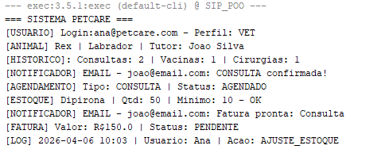

<h2 align ="left">🐾 Sistema Integrado PetCare (SIP) </h2>

 Sistema desenvolvido em <b>Java</b> aplicando os pilares da <b>Programação Orientada a Objetos (POO)</b> 

<h2 align ="left">🧠 Conceitos de POO Aplicados</h2>
<ul>
  <li>
    
✅ <b>Herança:</b> Utilizada na hierarquia de usuários (Usuario → Administrador, Veterinario, etc.)

  </li>
  <li>
    
✅ <b>Encapsulamento:</b> Todos os atributos são privados com validações em getters/setters

  </li>
  <li>
    
✅ <b>Composição:</b> Exemplo: Animal possui HistoricoClinico

  </li>
  <li>
    
✅ <b>Delegação:</b> Exemplo: Agendamento delega notificações para Notificador

  </li>
</ul>
<h2 align ="left">Exemplo de Saída</h2>

 
